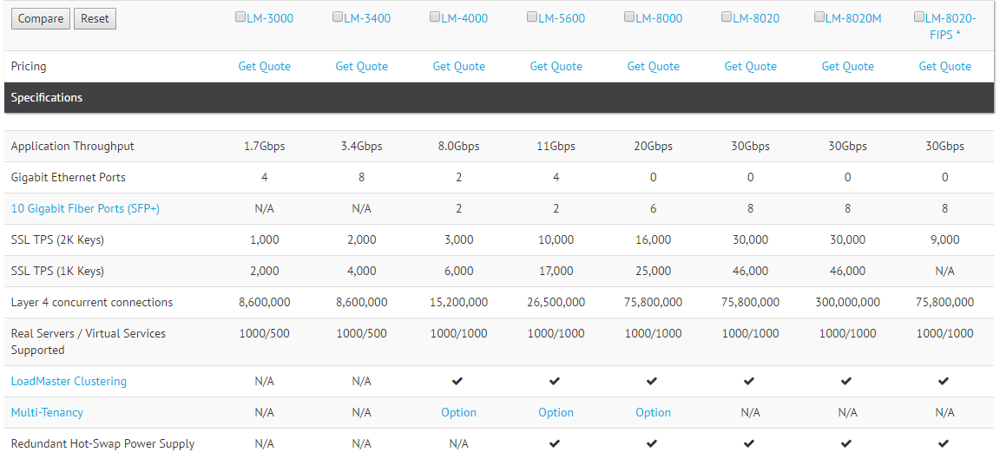

# Ejercicios Tema 4

### Ejercicio 1
**Buscar información sobre cuánto costaría en la actualidad un mainframe. Comparar precio y potencia entre esa máquina y una granja web de unas prestaciones similares.**

Pues según este [enlace](https://www.v3.co.uk/v3-uk/analysis/2390692/ibm-s-z13-shows-the-mainframe-still-has-its-place-for-now "Enlace de información"), están en un rango de 75.000$ a 2 millones.


### Ejercicio 2
**Buscar información sobre precio y características de balanceadores hardware específicos. Compara las prestaciones que ofrecen unos y otros.**
En la familia LM de kemptechnologies vemos los siguientes:



De los cuales no he podido obtener el precio, ya que me tendría que poner en contacto con ellos con un contacto de empresa real.


### Ejercicio 3
**Buscar información sobre los métodos de balanceo que implementan los dispositivos recogidos en el ejercicio 2.**

Estos son los algoritmos que implementan los balanceadores anteriores según su web:

- Round robin
- Weight round robin
- Least connection
- Agent-Based Adaptive Balancing
- Fixed weighting
- Weighted response time 
- Source IP hash

### Ejercicio 4
**Instala y configura en una máquina virtual el balanceador ZenLoadBalancer.**
En mi caso el trabajo realizado para clase consta de un cluster de balanceadores donde se usa este balanceador, por tanto, ruego verlo [aquí](https://github.com/salvi13/SWAP/blob/master/trabajo/ClusterDeBalanceadores.pdf "Enlace del trabajo") en donde viene ampliamente explicada la instalación de dicho balanceador.

### Ejercicio 5
**Probar las diferentes maneras de redirección HTTP. ¿Cuál es adecuada y cuál no lo es para hacer balanceo de carga global? ¿Por qué?**

- Redirección 301: Significa que se ha movido lo que había en esa URL a otra permanentemente.
- Redirección 302: Significa que se ha encontrado lo que había en esa URL pero que ahora está en otra distinta temporalmente.

En mi opinión es mejor la redirección 302, ya que la  301 es permanente y los buscadores se guardan la nueva url en lugar de la nueva, entonces en caso de fallo nos encontraremos con un error 404, mientras que con la 302, seguirán pidiendo la antigua y en caso de fallo al menos habrá algo para mostrar y no encontrarnos un error 404.

### Ejercicio 6
**Buscar información sobre los bloques de IP para los distintos países o continentes. Implementar en JavaScript o PHP la detección de la zona desde donde se conecta un usuario**

He encontrado esta [herramienta](http://chir.ag/projects/geoiploc/ "Enlace de herramienta") que nos proporciona una libreria en PHP para poder ver de que país es una IP, aquí dejo un ejemplo:


```php
<?php

  include("geoiploc.php"); // Must include this

  // ip must be of the form "192.168.1.100"
  // you may load this from a database
  $ip = $_SERVER["REMOTE_ADDR"];
  echo "Your IP Address is: " . $ip . "<br />";

  echo "Your Country is: ";
  // returns country code by default
  echo getCountryFromIP($ip);
  echo "<br />\n";

  // optionally, you can specify the return type
  // type can be "code" (default), "abbr", "name"

  echo "Your Country Code is: ";
  echo getCountryFromIP($ip, "code");
  echo "<br />\n";

  // print country abbreviation - case insensitive
  echo "Your Country Abbreviation is: ";
  echo getCountryFromIP($ip, "AbBr");
  echo "<br />\n";

  // full name of country - spaces are trimmed
  echo "Your Country Name is: ";
  echo getCountryFromIP($ip, " NamE ");
  echo "<br />\n";

?>
```

### Ejercicio 7
**Buscar información sobre métodos y herramientas para implementar GSLB.**

Para implementar un GSLB hay que situar en cada uno de los sitios un dispositivo con capacidad GSLB, de tal manera, que los diferentes dispositivos GSLB se comuniquen para decidir quien atiende la petición.
La decisión se puede tomar en base a uno o diferentes criterios, por ejemplo:

- Carga: en función  de la carga que tenga el Datacenter se envía a uno u otro.
- Latencia: en función de los tiempos de respuesta al usuario.
- Vector distancia: en función de los bloques de direccionamiento.
- DNS: implementando una Round Robin.