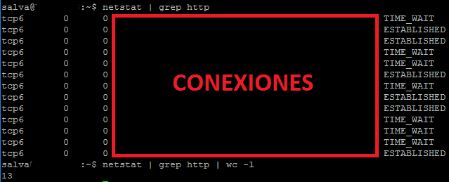
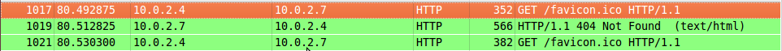
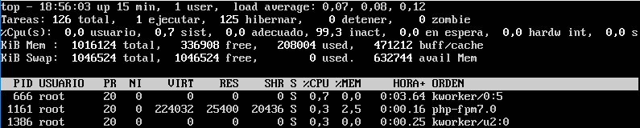
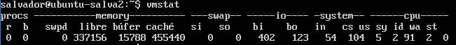

# Ejercicios Tema 5

### Ejercicio 1
**Buscar información sobre cómo calcular el número de conexiones por segundo.**

Una opción si tenemos nginx sería abrir el fichero de configuración nginx y añadir lo siguiente:
```bash
 location /nginx_status {
        # Turn on stats
        stub_status on;
        access_log   off;
        # only allow access from 192.168.1.5 #
        allow 192.168.1.5;
        deny all;
   }
```

Y proceder a acceder a la página correspondiente.

Otra opción sería utilizar netstat, para ello lanzamos la siguiente orden:
```bash
netstat | grep http | wc -l
```
Con esto nos devolverá exactamente las conexiones que hay, si quitamos el **wc -l** veríamos cuales son las conexiones exactas, como se ve en la siguiente imagen:



### Ejercicio 2
**Revisar los análisis de tráfico que se ofrecen en: http://bit.ly/1g0dkKj**

**Instalar wireshark y observar cómo fluye el tráfico de red en uno de los servidores web mientras se le hacen peticiones HTTP.**

Hacemos una petición http desde el cliente al servidor y vemos como wireshark muestra esa petición, tal y como se ve en la siguiente imagen:



### Ejercicio 3
**Buscar información sobre características, disponibilidad para diversos SO, etc de herramientas para monitorizar las prestaciones de un servidor.**

Por ejemplo:
–
- **top**:

- **vmstat**:

- **netstat** (Utilizando la orden que hemos usado anteriormente):
 

