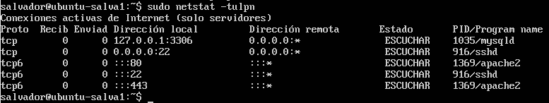

# Ejercicios Tema 6

### Ejercicio 1
**Aplicar con iptables una política de denegar todo el tráfico en una de las máquinas de prácticas.**

**Aplicar con iptables una política de permitir todo el tráfico en una de las máquinas de prácticas.**

- Denegar todo el tráfico:

```bash
iptables −P INPUT DROP
iptables −P OUTPUT DROP
iptables −P FORWARD DROP 
```

Con esto, no hay ningún tipo de tráfico. 

- Aceptar todo el tráfico:

```bash
iptables −P INPUT ACCEPT
iptables −P OUTPUT ACCEPT
iptables −P FORWARD ACCEPT 
```

Con esto, se permite todo el tráfico.

### Ejercicio 2
**Comprobar qué puertos tienen abiertos nuestras máquinas, su estado, y qué programa o demonio lo ocupa.**

Para comprobar que puertos tenemos abiertos y que demonio lo está usando usamos la siguiente orden:

```bash
sudo netstat -tulpn
```

Tal y como se ve en la siguiente imagen:



### Ejercicio 3
**Buscar información acerca de los tipos de ataques más comunes en servidores web (p.ej. secuestros de sesión). Detallar en qué consisten, y cómo se pueden evitar.**

- **DDoS**: Son intentos de inundar un sitio con solicitudes externas, por lo que ese sitio no podría estar disponible para los usuarios reales. Usar un balanceo de carga o usar un cortafuegos que banee a IP's en concreto seria una manera "sencilla" de evitarlo.
- **Inyección SQL**: Son cadenas que pueden introducirse en lugares como cajas de búsqueda, formas de inicio de sesión e incluso directamente en una url para anular las medidas de seguridad del cliente en la propia página. Se puede evitar usando una versión actual de conexión con MySQL como podría ser PDO.
- **Cross-site scripting**: Es un estilo de ataque en el que la parte delantera de la página web actúa como un punto de lanzamiento para ataques a otros usuarios que visitan el sitio web. Esto sucede cuando los desarrolladores no prueban correctamente su código para posibilidad de permitir scripts de ser inyectados, por tanto, una posible solución es una buena programación y testeo.