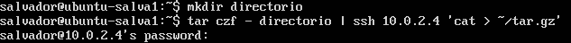
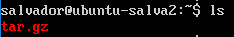
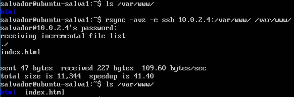
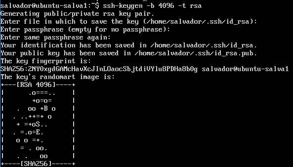
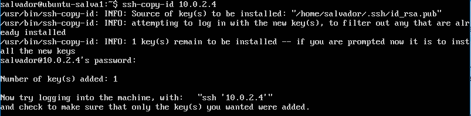
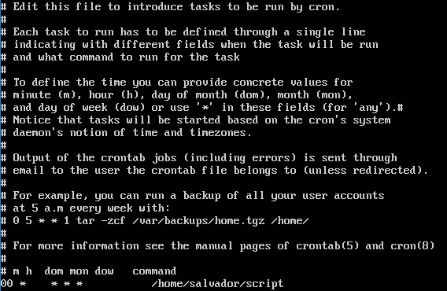

# Práctica 2. Clonar la información de un sitio web

### Crear un tar con ficheros locales en un equipo remoto

Para crear el paquete usamos el siguiente comando
 
```bash
tar czf - directorio | ssh 10.0.2.4 'cat > ~/tar.tgz'
```


Y una vez hecho, podemos ver el resultado:



### Sincronizar máquinas con rsync
Para realizar la sincronización, vamos a utilizar los ficheros que tenemos en nuestro espacio web, por tanto haremos un rsync con el siguiente comando

```bash
rsync -avz -e ssh 10.0.2.4:/var/www/ /var/www/ 
```



### Acceso sin contraseña para ssh
Ahora crearemos un par de claves ssh pública/privada, para ello usamos el comando
```bash
ssh-keygen -b 4096 -t rsa 
```



Una vez que tenemos las claves ssh, pasamos a copiar la clave pública en la otra máquina, para ello usamos el comando
```bash
ssh-copy-id 10.0.2.4
```



Y con esto, solo nos queda añadir a nuestro crontab el script realizado anteriormente del rsync en el tiempo que queramos realizarlo.

Para ello, desde nuestro propio usuario podemos lanzar el comando
```bash
crontab -e
```


Ahora, pondremos que cada hora a en punto se realiza una sincronización, para ello añadimos esto al crontab
```bash
00 *    * * *    /home/salvador/script
```


