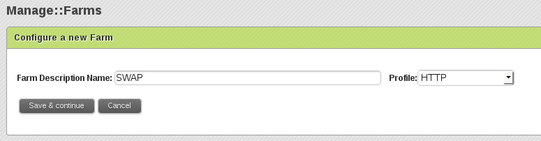
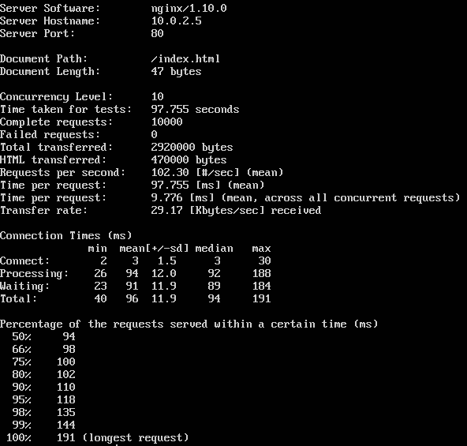
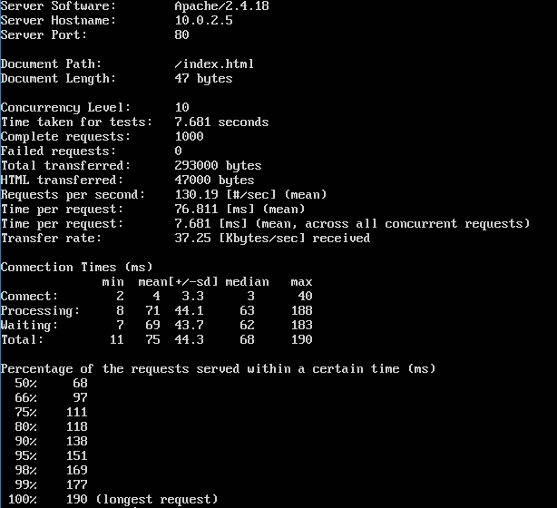

# Práctica 3. Balanceo de carga

### Instalación y configuración de nginx

Para instalar el paquete usamos el siguiente comando
 
```bash
sudo apt-get install nginx
```

Y una vez hecho, pasamos a configurarlo, para ello nos vamos al fichero, **/etc/nginx/conf.d/default.conf** en dicha configuración creamos un **upstream** llamado apaches que contienen las máquinas que van a balancearse, en este caso además le añadiremos pesos para que de cada 3 peticiones 2 las recoja la primera máquina y la otra solo reciba 1. 

Además debemos configurar el puerto por el que vamos a escuchar.

El nombre del servidor.

Los ficheros de logs y la raíz del sistema.

Por último configuramos la cabecera del proxy, tal y como vemos en la imagen siguiente:


Ahora procedemos a probar si el balanceo funciona correctamente:


### Instalación y configuración de haproxy

Para instalar el paquete usamos el siguiente comando
 
```bash
sudo apt-get install haproxy
```

Y una vez hecho, pasamos a configurarlo, para ello nos vamos al fichero, **/etc/haproxy/haproxy.cfg** en dicha configuración creamos un **backend** llamado servers que contienen las máquinas que van a balancearse, en este caso además le añadiremos pesos para que la primera máquina recoja más que la segunda. 

Además debemos configurar el modo en el que lo vamos a poner.

Los tiempos de respuestas.

Por donde se va a escuchar y quienes son los servidores que van a escuchar.

Tal y como vemos en la imagen siguiente:


Ahora procedemos a probar si el balanceo funciona correctamente:


### Instalación y configuración de Zen Load Balancer

Para instalar el balanceador, debemos descargarnos la ISO de la web:
```
    https://sourceforge.net/projects/zenloadbalancer/ 
```
 
Una vez instalado, para configurarlo entramos por el navegador a:
```
    https://ip-balanceador:444
```

Se observa una interfaz gráfica donde nos ofrece gráficas sobre el uso utilizado. Para crear una nueva granja nos vamos al menú **Manage>Farms**


Ahora le damos a new Farm y elegimos el nombre y el tipo de granaja que queremos crear, tal y como vemos en la imagen siguiente:



Una vez que hemos creado la granja, procedemos a añadir los servidores tal y lo dejamos tal y como vemos en la imagen:


Ahora procedemos a probar si el balanceo funciona correctamente:


### Someter a una alta carga el servidor balanceado
Apache Benchmark (ab) es una utilidad que se instala junto con el servidor Apache y permite comprobar el rendimiento de cualquier servidor web.
Para utilizarlo debemos entrar en un terminal y ejecutar el comando "ab" como sigue:
```
    ab -n 1000 -c 10 http://ip-balanceador/index.html
```

Los parámetros indicados en la orden anterior le indican al benchmark que solicite la página con la dirección anterior 1000 veces y hacer esas peticiones concurrentemente de 10 en 10.

En mi caso he hecho pruebas con 1000 y con 10000, como vemos en las siguientes imágenes:


Veamos como ha ido en mis balanceadores:


##### nginx con 1000


##### nginx con 10000


##### haproxy con 1000


##### haproxy con 10000


##### Zen Load Balancer con 1000


##### Zen Load Balancer con 10000


##### Conclusión

En este caso, como se ve por tiempos el más rápido es el **haproxy**.