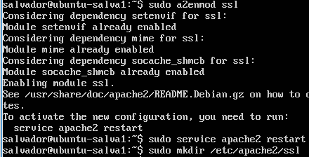
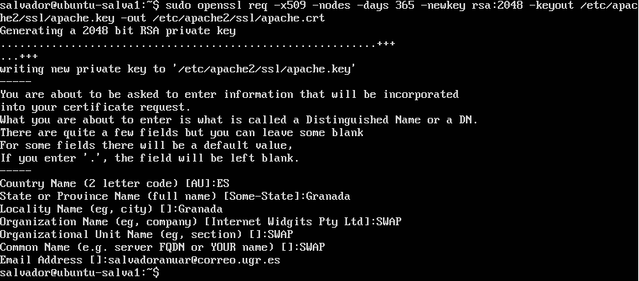
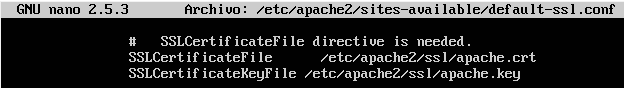
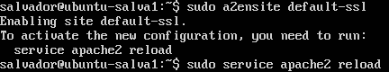
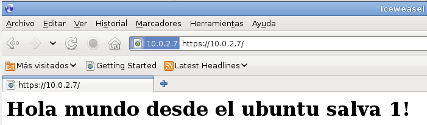
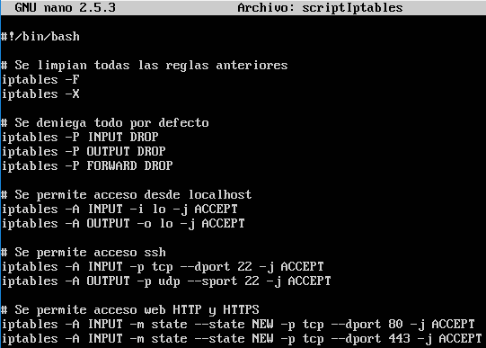
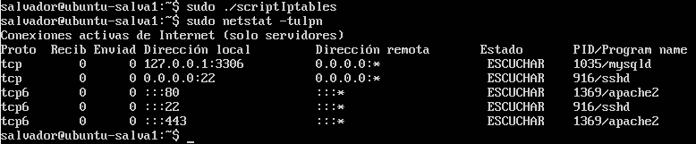
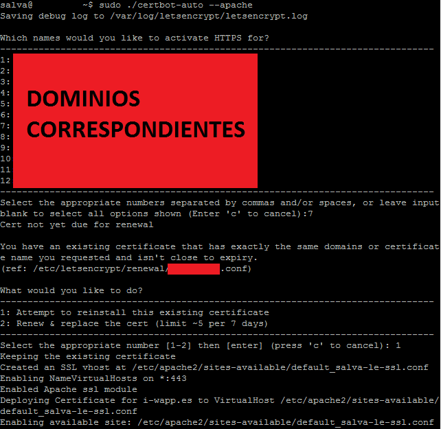
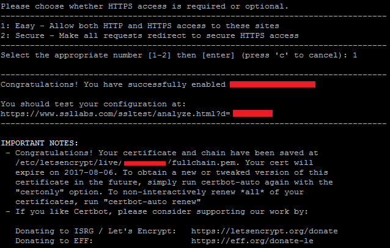
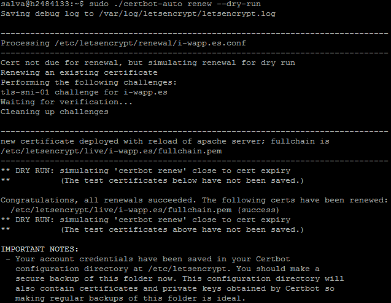

# Práctica 4. Asegurar la granja web

### Instalación y configuración de un certificado SSL autofirmado para el acceso por HTTPS

Para instalar configurar el acceso mediante HTTPS lo primero que debemos hacer es activar el módulo de SSL en apache con el comando:
 
```bash
sudo a2enmod ssl
```

Una vez hecho esto, se reinicia el servidor y creamos un directorio para guardar el certificado autofirmado que se va a crear, tal y como vemos en la siguiente imagen:



Ahora procedemos a crear el certificado autofirmado, para ello usamos la orden **openssl** con los parámetros correspondientes y rellenamos los datos que nos piden para el certificado, como vemos en la siguiente imagen:



Ahora se procede a modificar el fichero de configuración de apache, añadiendo el lugar de los certificados que se acaban de crear, tal y como se ve en la siguiente imagen:



Por último, se activa el sitio correspondiente y se recarga el servidor apache, tal como se ve en la siguiente imagen:



Y ahora se comprueba que efectivamente funciona:



### Configuración del cortafuegos

Para configurar adecuadamente iptables en una máquina Linux, conviene establecer
como reglas por defecto la denegación de todo el tráfico, salvo el que permitamos
después explícitamente.
En este caso, se ha optado por crear un script con todas las reglas que se van a utilizar, como se ve en la siguiente imagen:



Si se lanza este script, se puede comprobar que está correcto al lanzar la orden

```
    sudo netstat -tulpn
```

Y veremos que solo se escucha  por los puertos que se han indicado en el script, como se ve en la siguiente imagen:




### Instalación y configuración de un certificado SSL real usando Let's Encrypt

Para la creación del certificado con Let's Encrypt, se ha utilizado el **certbot** que es un cliente que se ocupa de crearte el certificado SSL y de renovarlo diariamente con una simple orden en el crontab, para instalarlo se han seguido los pasos que se indican en:  https://certbot.eff.org/#ubuntuxenial-apache

Una vez instalado se lanza la siguiente orden:
```
   sudo certbot-auto --apache
```

Y se verá lo mismo que en la siguiente imagen, aunque cambiando los dominios correspondientes por los que escucha directamente este servidor, tal y como se ve en la siguiente imagen:





Para renovar el certificado se necesita lanzar la orden:

```
    sudo certbot-auto renew --no-self-upgrade
```

Esto se añade al fichero **/etc/crontab** dos veces al día para tener en todo momento el certificado activado y renovado.
Para ver como funciona esta orden, se recomienda utilizar la orden
```
    sudo certbot-auto renew --dry-run
```
Y se ve por pantalla lo que hace para renovar, tal y  como se ve en la siguiente imagen:


