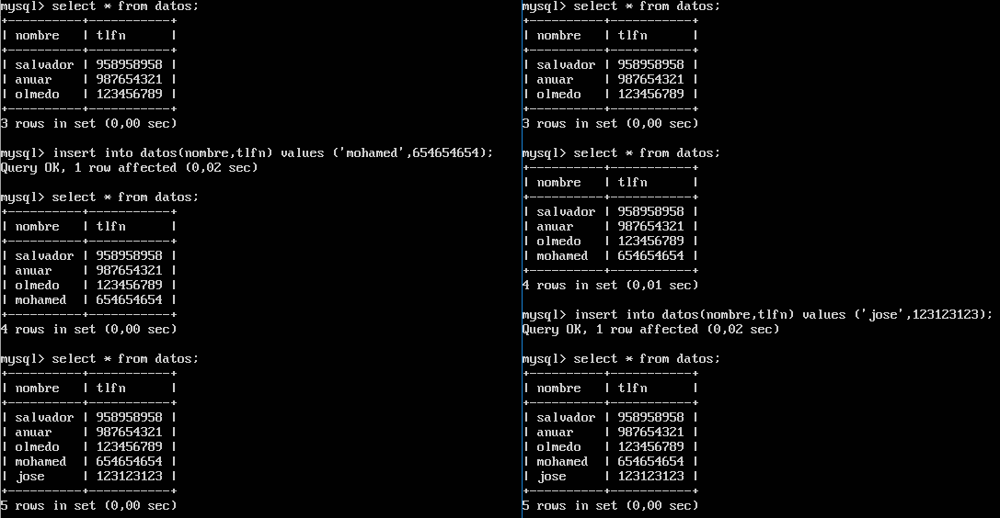

# Práctica 5. Replicación de bases de datos MySQL

### Crear una BD e insertar datos

Para ello, hay que conectarse a la consola de mysql con la orden:
 
```bash
mysql -u root -p
```

Una vez hecho esto, se crea la base de datos  y se crea una tabla para insertar los datos más adelante, como se ve en la siguiente imagen:


Ahora se procede a insertar un registro en dicha base de datos, tal y como se ve en la siguiente imagen:


### Replicar una BD MySQL con mysqldump

Para replicar un servidor mysql manualmente podemos utilizar la herramienta **mysqldump**, la cual es sencilla de usar y lo único que hay que hacer es bloquear las tablas y lanzar la orden:
```bash
mysqldump basededatosacopiar -u usuario -p > fichero.sql
```

Tal y  como se ve en la siguiente imagen:


Ahora para restaurar la copia en la otra máquina lo primero que debemos hacer es pasar el fichero sql con la copia del mysqldump a la segunda máquina para restaurar la base de datos con mysql, ya que lo que devuelve mysqldump es un fichero sql en texto plano y por tanto se pueden ejecutar directamente en sql.
Para ello, se usa la orden:

```bash
scp fichero.sql usuario@ip.maquina.2:/directorio
```


Una vez que se tiene el fichero sql, se debe crear primero la base de datos en la máquina y después restaurar con mysql, para crear la base de datos se utiliza lo mismo que en la primera máquina, para restaurar la copia con mysql solo tenemos que lanzar la siguiente orden:

```bash
mysql -u usuario -p basededatosarestaurar < fichero.sql
```

Y ya se puede ver que están los datos, como se ve en la siguiente imagen:


### Replicación de BD mediante una configuración maestro-esclavo

Para la replicación maestro-esclavo hay que modificar los ficheros de configuración de mysql, en este caso, el fichero de configuración está en **/etc/mysql/mysql.conf.d/mysqld.cnf**


Y hay que cambiar tres parámetros que no vienen como deben de estar para esta configuración, estos son:
* bind-address, el cual escucha a sí mismo por defecto.
* server-id, el cual viene comentado por defecto (y que debe ser distinto en el maestro y el esclavo).
* log_bin, el cual viene comentado por defecto y contiene toda la información que está disponible en el registro de actualizaciones.

De manera que el fichero en el maestro debe quedar tal y como se ve en la siguiente imagen:


Y en el esclavo debe quedar:


Ahora se reinicia el servidor para aplicar los cambios.
Y una vez hecho eso, se procede a crear un usuario con permiso de replicación para que replique todo en el esclavo:


Ahora se procede a configurar el esclavo indicando cual será su maestro, tal y como vemos en la siguiente imagen:


Por último se inicia el esclavo con la orden:
```bash
start slave;
```

Y se observa su estado, si se ve que el **second_behind_master** es distinto de NULL va correctamente, además de que como se observa en la imagen, indica que está conectado con la máquina correspondiente:


Ahora se procede a comprobar si efectivamente replica los datos:


### Replicación de BD mediante una configuración maestro-maestro

Añadiendo a lo anterior, lo único que se debe de hacer es mirar el estado del master en el esclavo:


Y proceder a crear la replicación:


Se observa su estado, si se ve que el **second_behind_master** es distinto de NULL va correctamente, además de que como se observa en la imagen, indica que está conectado con la máquina correspondiente:


Ahora se procede a comprobar si efectivamente replica los datos:

