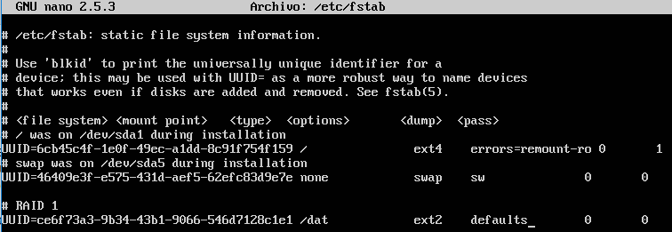
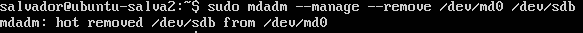
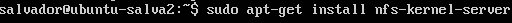

# Práctica 6. Discos en RAID

### Configuración del RAID por software

Para ello, hay que tener instalada la herramienta **mdadm**, para instalarla usamos la orden:
 
```bash
sudo apt-get install mdadm
```

Una vez hecho esto, vemos los discos que tenemos en la máquina con **fdisk -l**, para ver cuales son los utilizados en el raid que se va a crear, como se ve en la siguiente imagen:


Ahora ya podemos crear el RAID 1, usando el dispositivo /dev/md0, indicando el
número de dispositivos a utilizar (2), así como su ubicación:

```bash
sudo mdadm -C /dev/md0 --level=raid1 --raid-devices=2 /dev/sdb /dev/sdc
```

Tal y como se ve en la siguiente imagen:


Una vez creado el RAID hay que formatearlo, para ello usaremos la orden **mkfs** que nos formatea el RAID con formato **ext2**, para ello lanzamos la siguiente orden:
 
```bash
sudo mkfs /dev/md0
```

Tal y como se ve en la siguiente imagen:


Ahora procedemos a crear una carpeta donde montaremos el propio raid, para lo primero usamos **mkdir** y para lo segundo la orden **mount** tal y como vemos en la siguiente imagen:


Una vez montado vamos a comprobar el estado con la herramienta **mdadm** con la siguiente orden:

```bash
sudo mdadm --detail /dev/md0
```

Tal y como se ve en la siguiente imagen:


Para que no tengamos que montar el RAID cada vez que entremos en el sistema, podemos utilizar un script o directamente añadirlo al **fstab**, que es el fichero encargado de los puntos de montaje. 

En este caso haremos esto último, por ello, vamos a ver primero el **UUID** del RAID, para añadirlo en el **fstab**, con la orden **ls**:

```bash
ls -l /dev/disk/by-uuid/
```

Tal y como se ve en la siguiente imagen:


Una vez que tenemos el **UUID**, nos vamos al **fstab** y añadimos la siguiente línea, cogiendo nuestro propio **UUID**:

```bash
UUID=ccbbbbcc-dddd-eeee-ffff-aaabbbcccddd /dat ext2 defaults 0 0
```

Tal y como se ve en la siguiente imagen:



#### Fallo en un disco RAID

Una vez hecho todo lo anterior, vamos a provocar un fallo en el disco para ver que sigue funcionando el RAID correctamente, para ello seguimos usando la herramienta **mdadm** con la siguiente orden:

```bash
sudo mdadm --manage --set-faulty /dev/md0 /dev/sdb
```

Tal y como se ve en la siguiente imagen:


Y vemos los detalles como antes:

```bash
sudo mdadm --detail /dev/md0
```

Tal y como se ve en la siguiente imagen:


#### Eliminación de un disco RAID

Una vez que tenemos un fallo, vamos a eliminar un disco y ver que sigue funcionando el RAID correctamente, para ello seguimos usando la herramienta **mdadm** con la siguiente orden:

```bash
sudo mdadm --manage --remove /dev/md0 /dev/sdb
```

Tal y como se ve en la siguiente imagen:



Y vemos los detalles como antes:

```bash
sudo mdadm --detail /dev/md0
```

Tal y como se ve en la siguiente imagen:


#### Añadir un disco RAID

Una vez que hemos eliminado el disco con el fallo, vamos a añadir otro disco y ver que sigue funcionando el RAID correctamente, para ello seguimos usando la herramienta **mdadm** con la siguiente orden:

```bash
sudo mdadm --manage --add /dev/md0 /dev/sdb
```

Tal y como se ve en la siguiente imagen:


Y vemos los detalles como antes:

```bash
sudo mdadm --detail /dev/md0
```

Tal y como se ve en la siguiente imagen:


### Configuración de servidor NFS

Como ya tenemos el RAID creado, vamos a aprovechar y hacer que esta máquina sea servidor NFS de la otra, para ello, lo primero que debemos hacer es instalar el servidor NFS con la siguiente orden:

```bash
sudo apt-get install nfs-kernel-server
```

Tal y como se ve en la siguiente imagen:



Una vez instalado, procedemos a configurar el directorio que queremos exportar, para ello, nos vamos al fichero **/etc/exports** y añadimos el directorio a compartir, como vemos en la siguiente imagen:


**NOTA:** A la hora de añadir los parámetros correspondientes como el **rw**, no hay que dejar espacios en blanco, ya que esto ocasiona errores en el fichero y no funcionaría el servidor.

Ahora nos vamos al directorio **/dat** y creamos un fichero para comprobar después en el cliente que se comparte el directorio correctamente, en mi caso uso la orden **touch**:


#### Configuración de cliente NFS

Ahora procedemos a configurar el cliente,para ello, lo primero que debemos hacer es instalar el servidor NFS con la siguiente orden:

```bash
sudo apt-get install nfs-common
```

Tal y como se ve en la siguiente imagen:


Una vez instalado, procedemos a montar el directorio compartido en donde nosotros queramos con la orden **mount** , como vemos en la siguiente imagen:


Y con esto ya tenemos montado nuestro RAID y nuestro NFS.